# openshift-observability

## **What is Openshift Monitoring?**

OpenShift Container Platform includes a preconfigured, preinstalled, and self-updating monitoring stack that provides monitoring for core platform components. 

 Default dashboards in the OpenShift Container Platform web console include visual representations of cluster metrics to help you to quickly understand the state of your cluster. This stack, however, does not monitor user defined applications out of the box nor does it provide a way to scrape endpoints and monitor responses for service availablitiy.
 
Challenges:
- We needed a way to view the health and availability of user defined applications.
- We did not have a way of probing endpoints with Prometheus.

Outcome:
- This monitoring stack captures baseline metrics from apps installed on the cluster (Using Prometheus).
- Determines service availability by probing endpoints with Blackbox Exporter.

Scope:
- Gather metrics from user defined projects and determine availability of service endpoints with Blackbox Exporter.
- Display service availability on a Grafana dashboard.


What is Blackbox Exporter ? 
- Blackbox Exporter is a probing exporter that allows monitoring network endpoints using HTTP, HTTPS, DNS, ICMP or TCP protocols.
- This exporter generates multiple metrics on your configured targets, like general endpoint status, response time, redirect information, or certificate expiration dates.
- By default, when performing HTTP probes, this exporter uses the GET HTTP method to explore your targets and expects a status code similar to 2xx.

Blackbox Exporter Use case:
- Use to measure response times.
- As application developer wants to check the availability of services, their uptime and network health.
- Analysing the latency of specific targets and paths of services running in the same cluster

## Pre-Requisites:
<br> 

- OpenShift cluster. We tested with 4.11
- Docker

Check Default Route Using Below command in Open Shift Cluster 

    $ oc get route default-route -n openshift-image-registry --template=‘{{ .spec.host }}’

If Default Route is not there please configure it using Below Command 

    $ oc patchconfigs.imageregistry.operator.openshift.io/cluster--patch ‘{“spec”:{“defaultRoute”:true}}’--type=merge 

## Installation of Prometheus and Grafana
<br> 

1) Set the Namespace for the demo application and observability stack

     
        export NAMESPACE = <name of your namespace (you want to create)>
        echo $NAMESPACE
    


1) Run the script to create the namespace and prepare the cluster for observability stack installation.

       
        ./observability.sh 
       

1)  Run pipeline that install operators for Prometheus and Grafana.

    
        ./pipelinerun.sh


## Install Blackbox Exporter
<br>

1) Install Blackbox Helm ChartPrometheus community Blackbox exporter charts.

      reference link : https://github.com/prometheus-community/helm-charts/tree/main/charts/prometheus-blackbox-exporter

    ```
    helm repo add prometheus-community https://prometheus-community.github.io/helm-chartsb
    ```       

1) Update Helm repo using below command.

    ```        
    helm repo update
    ```

1) Install black-box helm chart into cluster using below command.

    ```
    helm install blackbox-exporter prometheus-community/prometheus-blackbox-exporter
    ```

1) Deploy a demo application

    - From the OpenShift console, click on the `Administrator` dropdown at the top left and select the `Developer` perspective.
    - Click on `Add` on the left navigation pane and click on `Samples`
    - Click on the `Basic Python` sample

    

    - Click `Create` on the `Import from Git`

    

    - Click on the `Developer` dropdown at the top left and select the `Administrator` perspective.
    - Then select the `Networking` tab on the left and click on `Routes`
    - Click on the route for your newly created application

    

    - From the overview of the application route, copy the `Location` value that contains the address to your demo application.

    

1) Open the `prometheus-job-blackbox-configuration.yaml` file in your code editor and for the `targets` entry under `static_config` enter the route URL copied in the previous step.

     
    
1) Next, we need to create a secret that contains our blackbox configuration. Run the following command

    ```
    oc create secret generic blackbox-secret --from-file=prometheus-job-blackbox-configuration.yaml
    ```

1) Update the Prometheus custom resource in OpenShift by doing the following

    - From the OpenShift Console, on the left navigation panel, click on `Operators` and select `Installed Operators`.
    - Ensure that you are in the namespace that you set at the beginning.
    - Click on the `Prometheus` operator
    - Select the tab that says `Prometheus` and click on the `prometheus` resource that appears.
    - On the next page, select the tab that says `YAML`
    - Add the following lines to that yaml as seen in the image below.

        additionalScrapeConfigs:
            key: prometheus-job-blackbox-configuration.yaml 
            name: blackbox-secret

    

<br />

## Configuring Grafana
<br>

1) On the left navigation panel, under `Workloads` click on `Secrets`.

1) Find the secret called `grafana-admin-credentials`

1) Scroll down and copy the value for `GF_SECURITY_ADMIN_PASSWORD`

    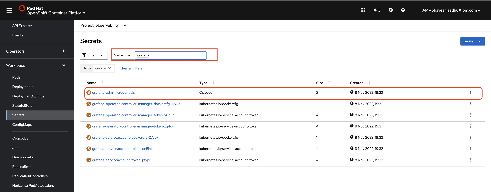


1) Click on `Networking` on the left navigation panel and select `Routes`.

1) Find the entry for `grafana-route` and click on the url in the `Location` column.

1) Log in using the admin credentials taken from the secret in the previous steps

    <!-- 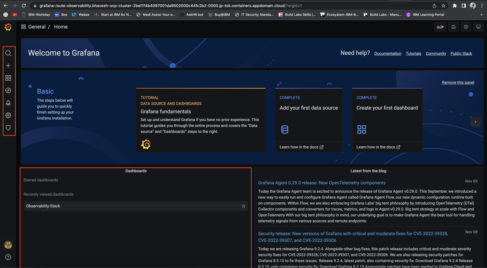 -->

### Add Prometheus Data Source
<br>

1) Click on the cog wheel for `Configuration` on the left navigation panel of grafana dashboard and ensure that you are on the `Data Sources` tab.

1) Click on the `Add data sources` button.

    

1) Select the option for a Prometheus data source..

    

    <!-- 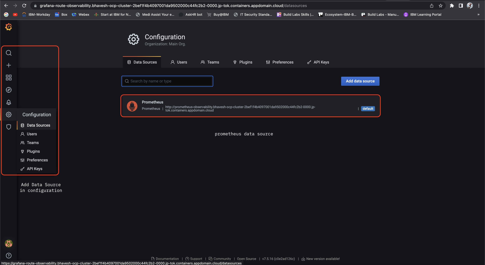 -->


1) In another browser window, go back to the Openshift Console and open the `Routes` in the `Networking` section of the left navigation bar.

1) Select the `Prometheus` route

1) Copy the value in the `Location` section

    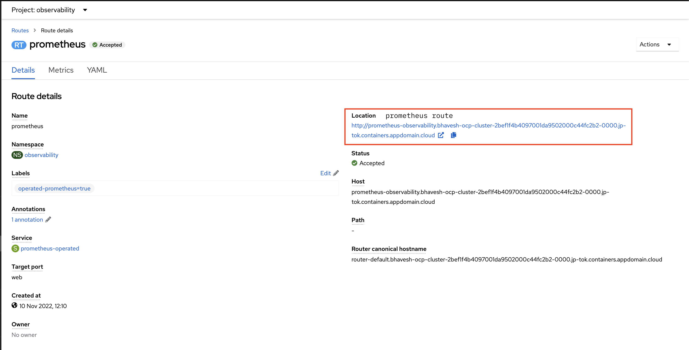


1) Go back to the browser tab that has Grafana open. You should be on the configuration page for a Prometheus data source.

1) In the `URL` field, enter the value of the `Prometheus` route that was copied in a previous step

    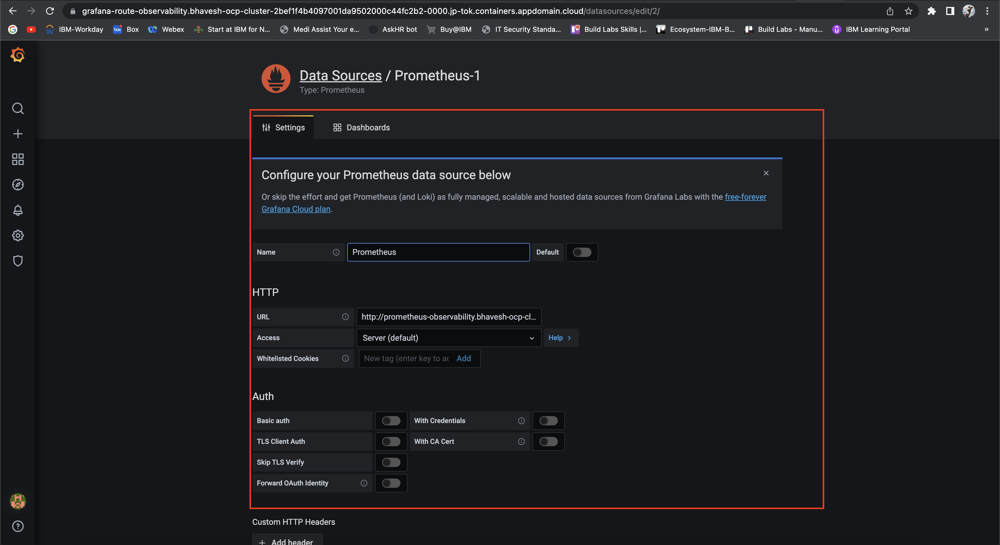

1) When done, click on `Save & Test` at the bottom. You should see a green message appear if the test was successful as seen below. 

    

<!-- => Grafana import prometheus data source

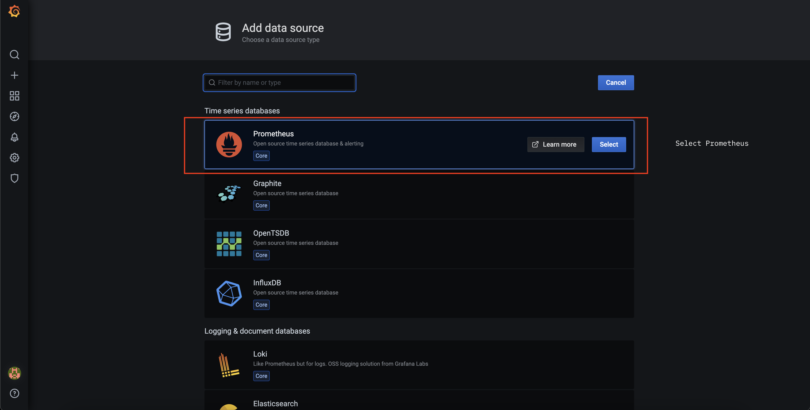


=> Check prometheus import 
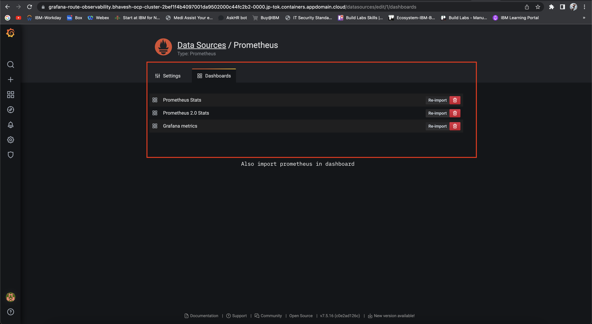 -->


### Add grafana dashboard
<br>

1) On the left navigation bar, click on the `+` to create a new dashboard.

1) Then, click on the box to `Add an empty panel`.

    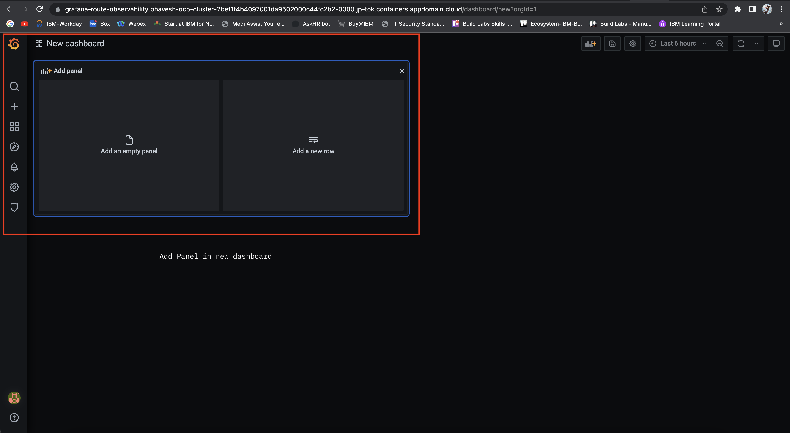


1) Go back to your browser tab for the Openshift Console where you copied the `Prometheus` route.

1) Click on the link in the `location` section.

    

1) In the search/query bar, enter `probe_success` and click on the blue `Execute` button to the right.

1) Then, copy the first result that is returned that ends with `name=Python App`. Your result should look similar to the image below, however, the `instance` value will be different.

    

1) Go back to your browser tab that has Grafana. You should be on the `New dashboard / Edit Panel` page.

1) On the right side of the page under the `Panel` settings, enter a name for the panel, in our example we used the name `Observability`.

1) Next, click to expand the `Visualization` section in the panel settings and select the option for `Gauge`.

1) Then, find the textbox with the `Metrics` dropdown before it in the lower-middle of the page. Enter the result from the Prometheus query executed in a previous step.

    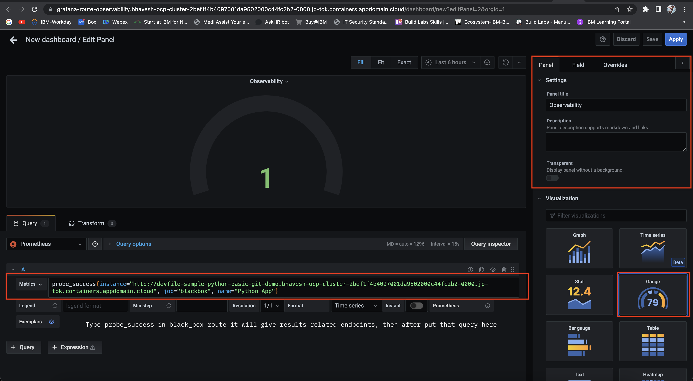

1) Click on the `Field` in the upper right of the page to switch to the field settings.

1) Then, find the field for Display name and enter `Python App`.

1) When done click on `Save` at the top right.

1) You will then be prompted for a Dashboard name, enter `Observability` and click save.

    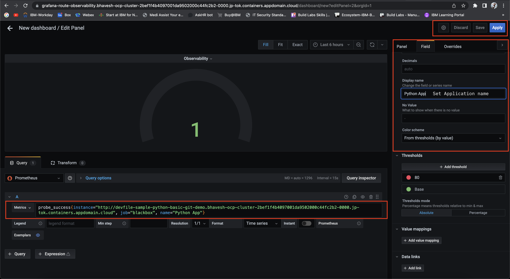


    Your dashboard should have one gauge monitoring if the Python application is up and running. 

When you are done, your dashboard should appear like the image below.


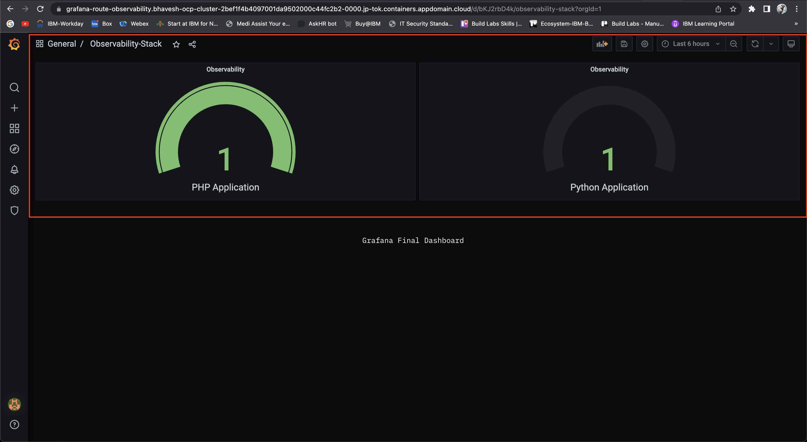


## Optional: Testing

Now that your dashboard is live, you will be able to see when one of your applications goes down. 

To test this out, do the following:
- Navigate to your application Deployments in Openshift
- Scale the Deployment down to 0 pods
- Check the dashboard and you should see the availability of the respective application lower to 0 to indicate that the application is not reachable.

## Conclusion
In this tutorial, you deployed a basic observability stack to monitor application availability using Prometheus, BlackBox Exporter, and Grafana.

However, this approach does have its limitations. For example, it doesn't really scale well as it is a very manual process which requires configuration to be done for each endpoint that you would like to monitor. If you are looking for an Enterprise ready monitoring solution that handles endpoint monitoring at scale, I would recommend that you check out [Instana](https://www.instana.com/). Instana is an Enterprise ready tool for observability, Application Performance Monitoring,and more. One of the features of Instana is [automatic discovery](https://www.ibm.com/docs/en/instana-observability/current?topic=monitoring-metrics) where Instana can automatically detect requests to figure out what needs to be monitored. 